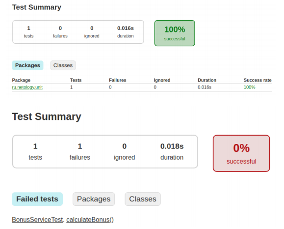

# Домашнее задание к лекции «Основы автоматизации»

Не забывайте заводить по найденным багам баг-репорты в Github Issue.

## Задача №1 - CashbackHacker

Вы участвуете в проекте CashbackHacker - небольшой сервис, который сообщает пользователю о том, сколько ему нужно "докупить" в рамках конкретной траты, чтобы получить максимальное количетство кэшбека.

Подробнее: кэшбек начисляется за каждую потраченную полную тысячу рублей, поэтому если вы покупаете что-то на 900 рублей, сервис должен посоветовать вам докупить "ещё чего-нибудь" на 100 рублей.

Код сервиса выглядит следующим образом:

```java
package ru.netology.service;

public class CashbackHackService {
    private final int boundary = 1000;

    public int remain(int amount) {
        return boundary - amount % boundary;
    }
}
```

Вам нужно создать проект на базе Gradle, добавить в него JUnit 5 и написать авто-тесты, которые тестируют функциональность приложения (как минимум, два).

В сервисе точно есть ошибка, поэтому один из ваших авто-тестов должен падать.

Выложите полученный проект на GitHub. Не забудьте про файл [.gitignore](../.gitignore).

<details>
    <summary>Подсказка</summary>

    Если пользователь купил ровно на 1000 рублей, то приложение не должно ему говорить, что нужно купить ещё на 1000.
</details>


## Задача №2 - Репортинг (необязательная)

Создайте issue на GitHub (в рамках первого проекта), к которому приложите архив с отчётами Gradle.

Напоминаю, выглядеть они (отчёты) должны примерно вот так (у вас должно быть не 100% successful):


