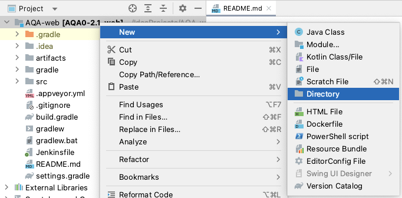
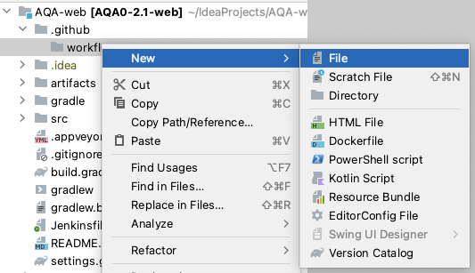
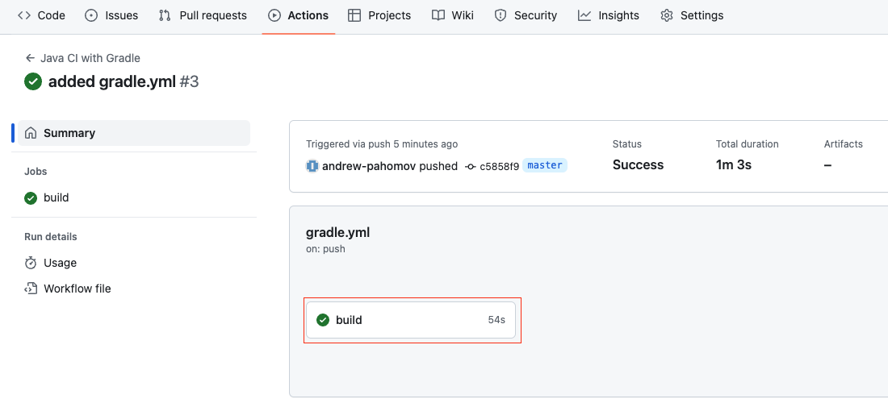
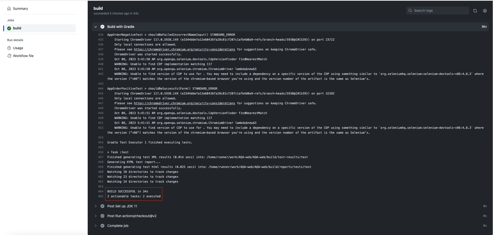
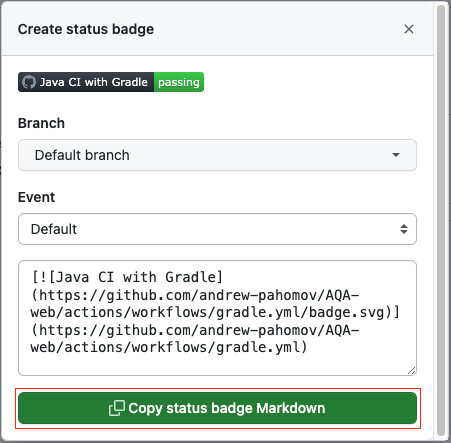

# Интеграция проектов c Github Actions        

1. После реализации проекта в Idea добавьте в папку .github/workflows файл gradle.yml  
        


2. Создайте в папке .github/workflows файл gradle.yml    
         


3. Поместите в созданный файл следующий код настройки интеграции на базе образа ubuntu-latest          

```yaml
name: Java CI with Gradle

on: [push, pull_request]

jobs:
  build:

    runs-on: ubuntu-latest

    steps:
      - uses: actions/checkout@v2
      - name: Set up JDK 11
        uses: actions/setup-java@v2
        with:
          java-version: '11'
          distribution: 'adopt'
      - name: Grant execute permission for gradlew
        run: chmod +x gradlew
      - name: Start SUT
        run: java -jar ./artifacts/app-mbank.jar & # Имя файла SUT будет отличаться в каждой задаче
      - name: Build with Gradle
        run: ./gradlew test --info  #  Для проектов на базе Selenide необходимо добавить параметр для запуска браузера
                                    #  в headless режиме -Dselenide.headless=true
```    


4. Добавьте файл gradle.yml в репозиторий, выполните коммит и пуш в удаленный репозиторий Github             


5. Результаты выполнения сборок вы найдете во вкладке Actions репозитория с проектом    
         
  
     


6. Код бейджа вы можете получить на странице одной из сборок       
     
        


7. Создайте в корне проекта файл README.md и поместите в него код бейджа      
     


8. Файл README.md необходимо добавить в репозиторий, выполнить коммит и пуш в удаленный репозиторий Github    


